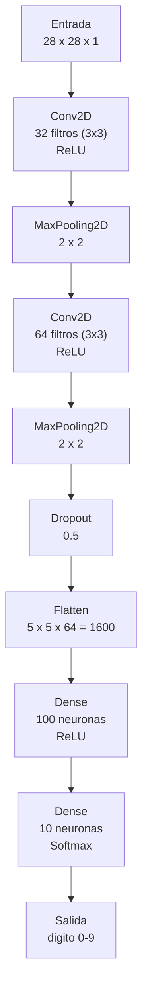

# Clasificador de Digitos MNIST

## Indice

1. [Resumen](#1-resumen)
2. [Instalacion](#2-instalacion)
3. [Despliegue](#3-despliegue)

---

## 1. Resumen

Este proyecto implementa una red neuronal convolucional (CNN) para clasificar digitos manuscritos del dataset **MNIST** (70.000 imagenes de 28 x 28 pixeles en escala de grises). La arquitectura utiliza dos capas convolucionales (32 y 64 filtros) con *MaxPooling*, *Dropout* al 50 % y dos capas densas. Se aplicaron tecnicas de aumento de datos (rotacion, desplazamiento y acercamiento) para mejorar la generalizacion. El modelo alcanza una precision del **98,7 %** en el conjunto de prueba y se exporta a **TensorFlow.js** para su uso en una aplicacion web interactiva.

**Autor:** Jefferson Mejia

### Arquitectura de la red



---

## 2. Instalacion

### 2.1. Entrenamiento del modelo

1. Abrir el cuaderno `P3Modelo_Numero_MejiaJefferson.ipynb` en Google Colab o en un entorno local con Jupyter.
2. Ejecutar todas las celdas en orden secuencial. El cuaderno descargara automaticamente el dataset MNIST, construira, entrenara y exportara el modelo.
3. Al finalizar, se generara el modelo en formato TensorFlow.js dentro de la carpeta `modelo/`.

### 2.2. Aplicacion web

1. Clonar el repositorio:

   ```bash
   git clone https://github.com/jeffersonmejia/clasificacion-numeros.git
   cd clasificacion-numeros
   ```

2. Abrir `index.html` directamente en un navegador web. No se requiere servidor local, TensorFlow.js se carga mediante CDN.
3. Dibujar un digito (0-9) en el lienzo o subir una imagen y presionar **Clasificar**.

---

## 3. Despliegue

La aplicacion web esta desplegada en **GitHub Pages** usando el modelo generado desde notebook colab:

> **https://jeffersonmejia.github.io/clasificacion-numeros/**
